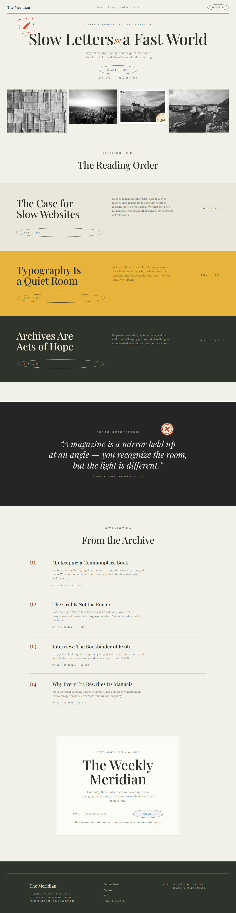
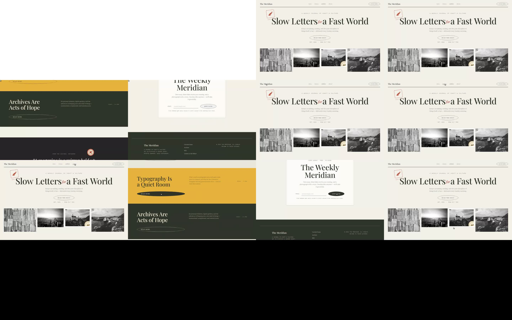
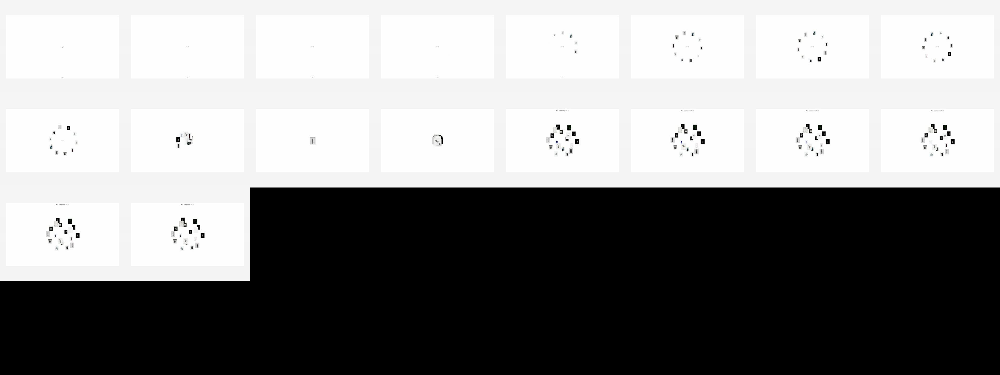

# awwwards-mcp

Free, open-source MCP server that gives AI agents design inspiration from
[Awwwards](https://www.awwwards.com/) — the Mobbin-style visual reference loop,
sourced from the web's best award-winning websites.

Your agent searches in natural language ("dark 3D portfolio sites", "soft pastel
e-commerce"), sees **real screenshots inline**, and can pull the **design DNA**
of any site: color palette, tech stack, design elements, award history.

## Tools

| Tool | What it does |
|------|--------------|
| `search_sites` | Search by color, tags, technology or award type. Returns site cards with inline screenshots. |
| `get_site_details` | Full design DNA for one site: palette, technologies, elements, awards, description. |
| `get_site_elements` | Component-level visuals for one site: each element's poster image inline (3D models, video content, mobile layouts, microcopy…) + video URLs. |
| `list_categories` | Every filter the agent can search by (200+ tags, 27 colors). |
| `capture_live_site` | Optional: fresh full-page screenshot of any live URL. Waits for `load` + a settle window with a bounded pre-scroll, so heavy sites work (`waitStrategy: "networkidle"` available). (needs [playwright](https://playwright.dev)). |
| `analyze_page_structure` | Section band map of any page (live URL or local file:// build): tag, background, offset, height per band. Compare a reference site's structure against your build. Same heavy-site-friendly wait (`waitStrategy: "networkidle"` available). (needs [playwright](https://playwright.dev)). |
| `record_site_motion` | Optional: short motion-through video of a live URL — preloader, scroll-triggered and hover/cursor animations. Returns an inline filmstrip JPEG plus the saved .webm path. (needs [playwright](https://playwright.dev) + ffmpeg-static). |

## Setup

Any MCP-compatible coding agent can use awwwards-mcp — no API key, no account.
Requires Node ≥ 22.13 (`node -v` to check). Pick your agent:

**Claude Code**

```bash
claude mcp add awwwards -- npx -y awwwards-mcp
```

**Codex CLI** (ChatGPT desktop app and the IDE extension share this config)

```bash
codex mcp add awwwards -- npx -y awwwards-mcp
```

or in `~/.codex/config.toml` (project-scoped: `.codex/config.toml`):

```toml
[mcp_servers.awwwards]
command = "npx"
args = ["-y", "awwwards-mcp"]
```

**OpenCode** (`opencode.json` — note the command is an array)

```json
{
  "$schema": "https://opencode.ai/config.json",
  "mcp": {
    "awwwards": {
      "type": "local",
      "command": ["npx", "-y", "awwwards-mcp"]
    }
  }
}
```

**ZCode** (`~/.zcode/cli/config.json` — note servers nest under `"mcp": { "servers": ... }`)

```json
{
  "mcp": {
    "servers": {
      "awwwards": { "command": "npx", "args": ["-y", "awwwards-mcp"], "env": {} }
    }
  }
}
```

**Claude Desktop / Cursor / Windsurf / Gemini CLI / Cline / Continue** — anything
reading the common `mcpServers` JSON shape (e.g. `~/.claude/claude_desktop_config.json`
or `~/.gemini/settings.json`):

```json
{
  "mcpServers": {
    "awwwards": { "command": "npx", "args": ["-y", "awwwards-mcp"] }
  }
}
```

**Anything else** — awwwards-mcp is a plain stdio MCP server: point your client
at `npx -y awwwards-mcp` and it works. To pin a version, use
`npx -y awwwards-mcp@1.0.0`.

**pi coding agent** has no built-in MCP by design — it uses skills and
extensions instead. Two options:

1. Install the awwwards-inspiration skill (below). pi reads skills from
   `~/.pi/agent/skills/` or `~/.agents/skills/` (the latter is shared across
   agents following the Agent Skills standard). The skill teaches the workflow;
   for it to reach the live data, add an MCP-supporting pi extension, or run
   the queries in another agent and paste results.
2. Skip MCP entirely: ask pi to build you a small CLI wrapper around
   awwwards.com, or use a shared skills directory (`~/.agents/skills/`) so the
   same skill file serves pi and every other agent.

Optional full-page captures (needed by `capture_live_site`,
`analyze_page_structure`, `record_site_motion`):

```bash
npm install -g playwright && npx playwright install chromium
```

`record_site_motion` additionally uses ffmpeg; it resolves the `ffmpeg-static`
package automatically if present.

## Skills

This package ships an agent skill that teaches the inspiration workflow —
search, judge from screenshots, pull design DNA, state a design direction —
using the awwwards MCP tools. Any agent that follows the
[Agent Skills standard](https://agentskills.io) can load it; copy it into your
agent's skills directory:

```bash
npm install awwwards-mcp
mkdir -p ~/.agents/skills && cp -r node_modules/awwwards-mcp/skills/awwwards-inspiration ~/.agents/skills/
```

| Agent | Skills directory |
|-------|------------------|
| Claude Code | `~/.claude/skills/` |
| pi | `~/.pi/agent/skills/` (also reads `~/.agents/skills/`) |
| ZCode | `~/.zcode/skills/` |
| Agent Skills-standard agents | `~/.agents/skills/` |

Windows: run this from Git Bash, or copy
`node_modules\awwwards-mcp\skills\awwwards-inspiration` manually.

## Indexing (recommended)

`search_sites` works out of the box, but its depth is limited by polite live
scraping (~31 sites per filter page). Build a local index once and searches
draw from thousands of award-winning sites instantly:

```bash
npx -y -p awwwards-mcp awwwards-index      # once published
# or, from a local checkout of this repo:
npm run index
```

- Crawls all ~200 tag pages at 1 request/second (~4 minutes) into the local
  SQLite cache at `~/.awwwards-mcp/`.
- Resumable: interrupt it and re-run — completed pages are skipped.
- The MCP server re-indexes automatically in the background whenever the
  index is older than 7 days (never blocking your session).

Site details (palettes, tech stacks) are still fetched on demand and cached
for 7 days.

## How it works

- Live, polite scraping of awwwards.com public pages (max 1 request/second,
  robots.txt-compliant paths only, cached 7 days in SQLite at `~/.awwwards-mcp/`).
- Screenshots are served from Awwwards' own CDN (880×660), cached on disk.
- No API key, no account, no cost.

## Ethics & terms

This tool fetches publicly available pages for **personal design-inspiration
use**, at human-ish request rates, honoring robots.txt. Awwwards' screenshots
and content remain the property of Awwwards and the credited creators — don't
bulk-scrape, redistribute, or republish them. If you use this commercially,
review awwwards.com's terms yourself.

## Built with awwwards-mcp: three real sites

Three complete sites were built through the full inspiration loop this MCP
enables, using nothing but the server's tools plus the shipped
`awwwards-inspiration` skill. Each one exercised a different corner of the
loop — and every correction the loop caught on the way became doctrine in the
skill.

**1. [Fallow Press](fallow-press/index.html)**
([source](fallow-press/)) — a flat-2D editorial journal, direction
**Emergence Magazine** (SOTD): pink `#FF9398` on cream and black, torn-paper
masthead (pure CSS `clip-path`, zero WebGL), giant grotesque display over
grayscale photography, serif-italic brand, three pages with **separate
horizontal** projects/about pages (GSAP ScrollTrigger pin +
`containerAnimation`).

| Torn-paper masthead (home) | Horizontal gallery (Fields) | Horizontal chapters (Practices) |
|---|---|---|
|  |  |  |

The loop as it ran:

1. `search_sites` (magazine filters) → shortlist judged from inline
   screenshots → `get_site_details` on Emergence Magazine.
2. **Capture before building**: `capture_live_site` + `record_site_motion`
   on the live site *first*; full-page PNG and motion .webm kept in
   [fallow-press/ref-motion/](fallow-press/ref-motion/) as the evidence trail.
3. Build, then verify: full-page capture plus **panel-center pin shots** of
   both horizontal pages (13 stops each, in
   [fallow-press/_qa/](fallow-press/_qa/) — `capture-qa.mjs` is reusable).
4. The pin shots caught a real bug: horizontal-panel entrances used
   `toggleActions: "play none none reverse"`, and 100vw panels hide content
   at midpoints on the way back — copy disappeared mid-view. Fix
   (one-shot play entrances) is now doctrine: **full-viewport panels get
   one-shot entrances**; QA pin shots land at panel **centers**, not uniform
   fractions, or you photograph empty transition zones.

**2. Cerebrium recreation** (`C:/Users/Afjal/cerebrium-recreation/`) — a
fidelity-first recreation of cerebrium.ai, pixel-checked against the live
reference: full-page captures of both sides, `analyze_page_structure` band
compare, and SVG icon/legend fixes until the build matched the reference to
within 1px of total page height (10,871px vs 10,870px). This is the
**structure-before-pixels** doctrine at its strictest — band maps compared,
never just totals.


**3. The Meridian** (`C:/Users/Afjal/editorial-site/`) — an editorial journal
built from ORDR/Hearst references: the first build to run the whole loop
end-to-end. `analyze_page_structure` caught a masthead band bug by comparing
the build's band map against the reference's; the reference captures,
motion film, and the reusable pre-scroll capture script live in
`editorial-site/_qa/`.





**An early lesson in one image** — the original showcase build's hero,
designed from element *posters* alone, rendered a spinning 3D ring as
floating static cards. The frame-tiled videos exposed the motion truth and
became the skill's poster-lie doctrine:



## Skills used to build these

| Skill | Role in the builds |
|---|---|
| `awwwards-inspiration` | The 8-step loop itself (ships with this package): search → judge from screenshots → design DNA → capture/motion study → state direction → build → band-map verify. |
| `gsap-scrolltrigger` | The horizontal pin + `containerAnimation` pattern (ease `"none"`, one-shot entrances) driving both Fallow Press horizontal pages. |
| `gsap-core` / `gsap-timeline` | Tween composition and sequenced hero entrances (torn-paper drop, panel copy rises). |
| `frontend-design` | Typography, palette and layout judgment applied when translating reference DNA into original pages. |
| `lenis` (library, via skill guidance) | smooth scrolling synced to ScrollTrigger on the Fallow Press home page. |
| `tailwindcss` / plain CSS | All builds are plain hand-rolled CSS — flat 2D, no frameworks needed. |

Reduced-motion, JS-less visits, and capture tools all get graceful fallbacks
(vertical stacks; progressive-enhancement reveals).

**What the verification loop caught** — proof the structure-before-pixels
doctrine is load-bearing:

- Element **posters lie**: the first showcase build was designed from poster
  frames alone and rendered a spinning 3D ring as *floating static cards*.
  Downloading the element videos (`get_site_elements`) and frame-tiling them
  revealed the motion truth — now the skill mandates studying motion before
  animating.
- Full-page captures of reveal-on-scroll builds showed blank sections: `.reveal`
  animation state vs capture's no-scroll reality. Builds ship
  content-visible-without-JS progressive enhancement.
- Horizontal-panel copy vanished **mid-view** on the Fallow Press pages:
  `toggleActions` reverse reverts entrances while a 100vw panel is still
  holding the viewport (see above).
- Band-map compare kept the references' rhythm instead of drifting on
  section heights (Cerebrium, The Meridian).

Prompt counts: **3** for the original showcase build (the build ask, the
motion correction that exposed the poster-lie, the structure pass) and
**1** for Fallow Press ("create a new website using our MCP and skills… no
3D websites") — its two follow-ups were caught by the QA loop, not by the
user. Each correction became doctrine in the shipped `awwwards-inspiration`
skill: frame-study element videos before animating; judge page architecture
from the studied passages; tile per element, not one giant filmstrip;
capture live sites and animation **before** building.

## Can awwwards-mcp crawl the sitemap? (robots.txt notes)

The awwwards.com `robots.txt` advertises
`Sitemap: https://www.awwwards.com/sitemap.xml` and — verified live
2026-09-18 — **that sitemap URL returns a soft-404 HTML page** (as do common
child names like `/sitemap-websites.xml`). So sitemap discovery isn't
currently a path to more data; the polite crawl surface is exactly what the
indexer uses:

- **Allowed and used**: `/websites/`, `/websites/<filter>/`, `/sites/<slug>`
  (one filter per URL; deep pagination stays un-crawled).
- **Disallowed and never fetched**: `/tag/`, `/search-websites`,
  `/websites/?` (query-string pagination), `/elements/*`, `/vote/`,
  favourites/likes/follows, and the rest of the 33 rules.
- Our client (`src/awwwards.ts` `buildFilterUrl`) constructs **only**
  `/websites/…` paths at 1 request/second — the loop stays inside the
  published rules by construction, not by convention.

## Contributing

PRs welcome! The project especially needs **parser-drift fixes** — when live
awwwards.com markup changes, a fresh HTML snapshot attached to an issue often
becomes the new test fixture and the fastest merged PR. See
[CONTRIBUTING.md](CONTRIBUTING.md) for the full guide:

- Development setup & project layout (offline fixture-tested, no network in tests)
- How to create a PR: fork → `fix/`/`feat/`/`docs/` branch → typecheck + tests → PR template
- The politeness constraints new code must keep (1 req/s, robots.txt paths, light runtime deps)

Bugs and feature ideas start as
[issues](https://github.com/INSANE0777/Awwwards-mcp/issues/new/choose) with
templates. Security problems go privately — see
[SECURITY.md](SECURITY.md). By participating you agree to the
[Code of Conduct](CODE_OF_CONDUCT.md).

## Development

```bash
npm install
npm test        # offline unit tests against committed HTML fixtures
npm run smoke   # manual live smoke test against awwwards.com
npm run build   # compile to dist/
```

MIT — see [LICENSE](LICENSE).
